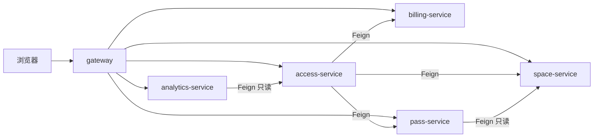

# GRASP 职责分配静态审计（【AI-辅助】草稿）

审计日期：2026-10-09。对象是当前仓库六个后端模块的 36 个 `src/main/java` 文件；7 个 `src/test/java` 文件只用于交叉核对，共 43 个文件、3447 行。前端、SQL 和模型不是代码审计对象，但用 `models/15-design-classes.puml` 核对了类图。**GRASP（General Responsibility Assignment Software Patterns）是九项职责分配原则，不是要安装或“接入”的框架。**下文判断的是职责分配是否合理，不声称“实现了 GRASP 框架”。`docs/code-audit.md` 的旧联调记录不等于本次静态审计证据。

审计方法：逐文件读取主代码，检查构造器字段、方法调用、HTTP 路径、事务边界和实体所有权；用测试方法及断言交叉核对；以源码行号、`rg` 计数和 Maven 实际输出定位。直接依赖数只计**构造器注入的外部协作者**（Feign、仓储、JdbcTemplate、缓存、幂等器、计费器），不计 DTO、配置值、日志器、Java 标准库或框架注解。此口径是类级静态计数，不等于运行时请求数或模块构建依赖数。项目规则仍以 `AGENTS.md`、`docs/api-contract.md`、`docs/decisions.md` 为准。

## 一、九项模式判定

| 模式 | 适用与强度 | 源码落点 | 判定依据与边界 |
|---|---|---|---|
| Information Expert 信息专家 | 适用，强 | [BillingService.java:30](../billing-service/src/main/java/cn/jsuhao/parking/billing/BillingService.java#L30)、[PassService.java:201](../pass-service/src/main/java/cn/jsuhao/parking/pass/PassService.java#L201)、[SpaceOperations.java:143](../space-service/src/main/java/cn/jsuhao/parking/space/SpaceOperations.java#L143)、[ParkingPricing.java:33](../billing-service/src/main/java/cn/jsuhao/parking/billing/ParkingPricing.java#L33) | 账单/支付、权益/台账、占位/充电、费率分别由持有自有数据或规则的服务处理；access 只消费必要快照。并非每个实体都有独立领域对象。 |
| Creator 创建者 | 适用，中 | [SpaceOperations.java:46](../space-service/src/main/java/cn/jsuhao/parking/space/SpaceOperations.java#L46)、[SpaceOperations.java:183](../space-service/src/main/java/cn/jsuhao/parking/space/SpaceOperations.java#L183)、[BillingService.java:40](../billing-service/src/main/java/cn/jsuhao/parking/billing/BillingService.java#L40)、[PassService.java:72](../pass-service/src/main/java/cn/jsuhao/parking/pass/PassService.java#L72) | 持有创建所需规则和数据库事务的服务生成 ID 并插入车位/充电会话、账单、预约。控制器方法参数里的请求 record 由 HTTP 反序列化提供，不能说是控制器主动创建。 |
| Controller 控制器 | 适用，强 | [AccessController.java:36](../access-service/src/main/java/cn/jsuhao/parking/access/AccessController.java#L36)、[SpaceController.java:31](../space-service/src/main/java/cn/jsuhao/parking/space/SpaceController.java#L31)、[ChargingController.java:22](../space-service/src/main/java/cn/jsuhao/parking/space/ChargingController.java#L22)、[BillingController.java:19](../billing-service/src/main/java/cn/jsuhao/parking/billing/BillingController.java#L19)、[PassController.java:20](../pass-service/src/main/java/cn/jsuhao/parking/pass/PassController.java#L20)、[TrafficController.java:42](../analytics-service/src/main/java/cn/jsuhao/parking/analytics/TrafficController.java#L42) | HTTP 控制器主要转交服务、包装响应；计费在 `ParkingPricing`，权益在 `PassService`。`BillingController` 按内部/外部路由传 `allowMonthly`，属于访问边界选择，不在控制器计算金额。 |
| Low Coupling 低耦合 | 适用，中 | [AccessService.java:31](../access-service/src/main/java/cn/jsuhao/parking/access/AccessService.java#L31)、[ServiceClients.java:18](../access-service/src/main/java/cn/jsuhao/parking/access/ServiceClients.java#L18)、[SpaceClient.java:8](../pass-service/src/main/java/cn/jsuhao/parking/pass/SpaceClient.java#L8)、[TrafficController.java:60](../analytics-service/src/main/java/cn/jsuhao/parking/analytics/TrafficController.java#L60) | 跨服务经 Feign + 本地 DTO，不 import 其他服务实现；服务依赖图无循环。access 协调三项下游，直接协作者 4 个是业务编排成本；pass 调 space 的公共路径与契约口径不一，见疑点 7。 |
| High Cohesion 高内聚 | 适用，中 | [AccessService.java:43](../access-service/src/main/java/cn/jsuhao/parking/access/AccessService.java#L43)、[PassService.java:54](../pass-service/src/main/java/cn/jsuhao/parking/pass/PassService.java#L54)、[SpaceOperations.java:105](../space-service/src/main/java/cn/jsuhao/parking/space/SpaceOperations.java#L105)、[TrafficController.java:68](../analytics-service/src/main/java/cn/jsuhao/parking/analytics/TrafficController.java#L68) | access 围绕一次停车会话；pass 围绕预约/月卡权益，但 411 行已使变更面偏大；space 的占位与充电通过同一车位锁和结算冻结关联；TrafficService 将计算、持久化、缓存装在同一报表生命周期。需要监控变更成本，不能只凭行数判违规。 |
| Polymorphism 多态 | 适用，弱 | [ParkingPricing.java:47](../billing-service/src/main/java/cn/jsuhao/parking/billing/ParkingPricing.java#L47)、[ParkingPricing.java:62](../billing-service/src/main/java/cn/jsuhao/parking/billing/ParkingPricing.java#L62)、[ParkingPricing.java:137](../billing-service/src/main/java/cn/jsuhao/parking/billing/ParkingPricing.java#L137) | 唯一明确业务策略接口是私有嵌套 `BenefitPolicy`：`NONE` 用匿名类、`RESERVATION`/`MONTHLY` 用 lambda，统一调用 `discount`。策略**选择**仍由 switch 完成；丢卡与超长附加费在 67–73 行由条件分支处理，不能画成具名异常策略。 |
| Pure Fabrication 纯虚构 | 适用，中 | [AccessRepository.java:21](../access-service/src/main/java/cn/jsuhao/parking/access/AccessRepository.java#L21)、[Idempotency.java:10](../space-service/src/main/java/cn/jsuhao/parking/space/Idempotency.java#L10)、[IdempotencyStore.java:12](../pass-service/src/main/java/cn/jsuhao/parking/pass/IdempotencyStore.java#L12) | 仓储和幂等器是技术职责对象，不是停车领域实体；它们把 SQL/重试记录从调用者隔离。独立仓储类仅 access 有；其他服务直接使用 JdbcTemplate，这是一种分层取舍，不是“必须九模式全覆盖”的错误。 |
| Indirection 间接性 | 适用，中 | [GatewayApplication.java:7](../gateway/src/main/java/cn/jsuhao/parking/gateway/GatewayApplication.java#L7)、[gateway/application.yml](../gateway/src/main/resources/application.yml)、[ServiceClients.java:18](../access-service/src/main/java/cn/jsuhao/parking/access/ServiceClients.java#L18)、[Idempotency.java:22](../space-service/src/main/java/cn/jsuhao/parking/space/Idempotency.java#L22) | Gateway 配置路由将浏览器与服务地址隔开；Feign 接口将调用方与下游实现隔开；幂等器隔离重复请求记录。Gateway 路由在 YAML 中，Java 启动类本身不实现路由。 |
| Protected Variations 受保护的变化 | 适用，中 | [PricingProperties.java:6](../billing-service/src/main/java/cn/jsuhao/parking/billing/PricingProperties.java#L6)、[ParkingPricing.java:27](../billing-service/src/main/java/cn/jsuhao/parking/billing/ParkingPricing.java#L27)、[SpaceOperations.java:26](../space-service/src/main/java/cn/jsuhao/parking/space/SpaceOperations.java#L26)、[PassService.java:37](../pass-service/src/main/java/cn/jsuhao/parking/pass/PassService.java#L37) | 费率 16 项与充电/权益参数走配置绑定，Nacos 导入可选且本地有默认值；旧账单保留费率版本快照。JSON 有 Jackson 2/3 两套手动/注入配置，是尚未完全隔离的技术变化点。 |

## 二、六问回答

### 1. 哪些模式有真实落点？

九项均有可指认的落点，但深度不同，见上表。最直接的是信息专家、HTTP 控制器、配置隔离；多态仅 [ParkingPricing.java:47–62](../billing-service/src/main/java/cn/jsuhao/parking/billing/ParkingPricing.java#L47) 一处。类图 15 号的私有嵌套接口、匿名类实现线和两种 lambda 注释与源码相符；不能增加不存在的策略类。

### 2. 哪些应用得弱？

多态只处理权益折扣；异常费仍是 [ParkingPricing.java:67](../billing-service/src/main/java/cn/jsuhao/parking/billing/ParkingPricing.java#L67) 的分支。独立仓储这一种纯虚构只在 [AccessRepository.java:21](../access-service/src/main/java/cn/jsuhao/parking/access/AccessRepository.java#L21)，但 space/pass 另有幂等器。`PassService` 同时处理预约、月卡与台账，且其实例字段为 [PassService.java:29–35](../pass-service/src/main/java/cn/jsuhao/parking/pass/PassService.java#L29) 的 7 个，另有两个静态字段（28、398 行）；预查提示词的“8 个字段”不是准确的实例字段口径。按本文直接依赖口径是 3 个协作者。`TrafficController.java` 214 行含 9 个包可见顶层类型（类、接口与 record），不是“4 个顶层类型”；见 [TrafficController.java:35–192](../analytics-service/src/main/java/cn/jsuhao/parking/analytics/TrafficController.java#L35)。这些是维护性特征，暂不等于运行缺陷。

### 3. 是否有具体偏离？

有一处**契约分层偏离**：项目规定服务间路径以 `/internal/v1` 开头（`docs/api-contract.md` 通用格式），access 与 analytics 遵守，但 pass 的 Feign 客户端读 [SpaceClient.java:10](../pass-service/src/main/java/cn/jsuhao/parking/pass/SpaceClient.java#L10) 的 `/api/v1/spaces`。这使 pass 依赖面向浏览器的公共读接口，弱化调用方隔离；当前读请求仍能工作，不能写成实测故障。不能直接把路径改成 `/internal/v1/spaces/available`，后者只返回 `AVAILABLE`，而 [PassService.java:314–317](../pass-service/src/main/java/cn/jsuhao/parking/pass/PassService.java#L314) 只排除 `OUT_OF_SERVICE`，简单替换会改变预约语义。应先由负责人审议专门的内部只读接口，再同步契约、模型和测试。Jackson 混用见疑点 6，是迁移风险，尚无证据证明当前 JSON 错误。

### 4. 依赖方向、计数与循环

业务边见 [AccessService.java:31–40](../access-service/src/main/java/cn/jsuhao/parking/access/AccessService.java#L31)、[PassService.java:29–47](../pass-service/src/main/java/cn/jsuhao/parking/pass/PassService.java#L29)、[TrafficController.java:60–78](../analytics-service/src/main/java/cn/jsuhao/parking/analytics/TrafficController.java#L60)；Gateway 路由见 [application.yml](../gateway/src/main/resources/application.yml)。图是静态依赖方向，不表示所有边在每次请求都发生。可从 business → lower-level 单向排序，没有业务服务调用环。遍历 36 个主文件的 `import cn.jsuhao.parking.{space,access,billing,pass,analytics}` 后，仅见 access 模块自身的 `AccessRepository.SessionRow` import，**外服务 Java import 为 0**；没有 `new` 下游服务实现类，跨服务创建的是本地 DTO/Feign 请求。

| 关键类 | 直接协作者数 | 依据 |
|---|---:|---|
| AccessController / AccessService / AccessRepository | 1 / 4 / 1 | [AccessController.java:30](../access-service/src/main/java/cn/jsuhao/parking/access/AccessController.java#L30)、[AccessService.java:31–34](../access-service/src/main/java/cn/jsuhao/parking/access/AccessService.java#L31)、[AccessRepository.java:23](../access-service/src/main/java/cn/jsuhao/parking/access/AccessRepository.java#L23) |
| SpaceController / ChargingController / SpaceOperations / Idempotency | 1 / 1 / 2 / 2 | [SpaceController.java:16](../space-service/src/main/java/cn/jsuhao/parking/space/SpaceController.java#L16)、[ChargingController.java:15](../space-service/src/main/java/cn/jsuhao/parking/space/ChargingController.java#L15)、[SpaceOperations.java:21–24](../space-service/src/main/java/cn/jsuhao/parking/space/SpaceOperations.java#L21)、[Idempotency.java:12–14](../space-service/src/main/java/cn/jsuhao/parking/space/Idempotency.java#L12) |
| BillingController / BillingService / ParkingPricing | 1 / 2 / 1 | [BillingController.java:15](../billing-service/src/main/java/cn/jsuhao/parking/billing/BillingController.java#L15)、[BillingService.java:21–23](../billing-service/src/main/java/cn/jsuhao/parking/billing/BillingService.java#L21)、[ParkingPricing.java:21–30](../billing-service/src/main/java/cn/jsuhao/parking/billing/ParkingPricing.java#L21)；Pricing 的 1 是配置提供者，不是下游业务服务 |
| PassController / PassService / IdempotencyStore | 1 / 3 / 2 | [PassController.java:16](../pass-service/src/main/java/cn/jsuhao/parking/pass/PassController.java#L16)、[PassService.java:29–31](../pass-service/src/main/java/cn/jsuhao/parking/pass/PassService.java#L29)、[IdempotencyStore.java:14–19](../pass-service/src/main/java/cn/jsuhao/parking/pass/IdempotencyStore.java#L14) |
| TrafficController / TrafficService / SavedReportCache | 1 / 3 / 1 | [TrafficController.java:36](../analytics-service/src/main/java/cn/jsuhao/parking/analytics/TrafficController.java#L36)、[TrafficController.java:70–72](../analytics-service/src/main/java/cn/jsuhao/parking/analytics/TrafficController.java#L70)、[SavedReportCache.java:19–23](../analytics-service/src/main/java/cn/jsuhao/parking/analytics/SavedReportCache.java#L19) |
| GatewayApplication | 0 | [GatewayApplication.java:7](../gateway/src/main/java/cn/jsuhao/parking/gateway/GatewayApplication.java#L7)；路由由 YAML 配置，非 Java 字段 |

### 5. 有无不相关职责集中？

候选是 `PassService`、`SpaceOperations`、`TrafficService`，但尚不足以断言应拆。`PassService.reserve` 的预约与预付/退款用本服务表、同一事务；`createMonthly` 与台账也在 [PassService.java:228–283](../pass-service/src/main/java/cn/jsuhao/parking/pass/PassService.java#L228) 的本地事务内。拆为两个类可以减小文件与测试范围，**仍可保持一个服务/一个库**，但必须把事务放在真正跨表调用入口，不能未经检查将协调方法拆出而改变原子性。`SpaceOperations.settle/startCharging` 共用车位行锁与结算冻结窗口，见 [SpaceOperations.java:143–190](../space-service/src/main/java/cn/jsuhao/parking/space/SpaceOperations.java#L143)；拆类后必须保留锁次序。`TrafficService.preview/generate/saved` 围绕一个报表生命周期，且缓存只读已保存快照，见 [TrafficController.java:80–163](../analytics-service/src/main/java/cn/jsuhao/parking/analytics/TrafficController.java#L80)。在课程规模下先记录变更热点，不以行数触发重构。

### 6. 哪些疑点不该现在改？

不为统一外形而抽五个仓储、空服务接口或跨服务公共幂等包；这些动作会扩大模型 15、服务测试和已验证故障窗口的同步范围，却没有当前故障证据。`AccessService` 的 [出场意图持久化与重试](../access-service/src/main/java/cn/jsuhao/parking/access/AccessService.java#L159)、[已付待释放恢复](../access-service/src/main/java/cn/jsuhao/parking/access/AccessService.java#L219) 是已验证的一致性设计，不能为拆类而破坏。详见下表逐项判断。

## 三、八项疑点与建议动作

| # | 现象 / 源码证据 | 判断 | 建议动作与改动风险 |
|---|---|---|---|
| 1 | access 有 [AccessRepository.java:21](../access-service/src/main/java/cn/jsuhao/parking/access/AccessRepository.java#L21)；billing、pass、space、analytics 分别在 [BillingService.java:21](../billing-service/src/main/java/cn/jsuhao/parking/billing/BillingService.java#L21)、[PassService.java:29](../pass-service/src/main/java/cn/jsuhao/parking/pass/PassService.java#L29)、[SpaceOperations.java:21](../space-service/src/main/java/cn/jsuhao/parking/space/SpaceOperations.java#L21)、[TrafficController.java:71](../analytics-service/src/main/java/cn/jsuhao/parking/analytics/TrafficController.java#L71) 直接持有 JdbcTemplate | **非问题（风格不一致）** | 统一抽仓储可隔离 SQL、方便替换持久化，但增加类/映射/测试、更新五服务类图，且可能改事务边界；当前无需求驱动，不动。 |
| 2 | [TrafficController.java:35–192](../analytics-service/src/main/java/cn/jsuhao/parking/analytics/TrafficController.java#L35) 一个 214 行文件含 9 个顶层类型 | **非问题（可读性债）** | 类型各有职责，放在一起没有把业务规则写入 Controller；拆文件能更容易导航，但不改变耦合/运行语义，带来文件与类图同步成本，暂不动。 |
| 3 | [PassService.java:54–305](../pass-service/src/main/java/cn/jsuhao/parking/pass/PassService.java#L54) 同管预约、预付/退款、月卡与余额；7 个实例字段在 29–35 行 | **需要负责人决策** | 若后续功能继续扩展，可在本服务内拆 reservation/monthly 两个类；保持同一数据库，并复核 `@Transactional` 与幂等响应在同一事务内。当前课程交付前拆分风险高。 |
| 4 | [SpaceOperations.java:105–218](../space-service/src/main/java/cn/jsuhao/parking/space/SpaceOperations.java#L105) 同管车位和充电 | **非问题（紧密耦合的聚合操作）** | 冻结与新增充电互斥依赖同一车位锁；拆类要重新证明并发原子性，短期不动。 |
| 5 | [Idempotency.java:22–51](../space-service/src/main/java/cn/jsuhao/parking/space/Idempotency.java#L22) 与 [IdempotencyStore.java:22–49](../pass-service/src/main/java/cn/jsuhao/parking/pass/IdempotencyStore.java#L22) 相似 | **非问题（局部重复）** | 前者有 `TransactionTemplate`、后者依赖调用方 `@Transactional`；表名、签名与序列化器也不同。跨服务抽含 SQL/事务的公共业务模块违背本项目边界；留在各服务比错误抽象安全。将来若只抽纯通用工具，须先冻结协议。 |
| 6 | [AccessService.java:6](../access-service/src/main/java/cn/jsuhao/parking/access/AccessService.java#L6)、[BillingService.java:3](../billing-service/src/main/java/cn/jsuhao/parking/billing/BillingService.java#L3)、[Idempotency.java:3](../space-service/src/main/java/cn/jsuhao/parking/space/Idempotency.java#L3)、[SavedReportCache.java:3](../analytics-service/src/main/java/cn/jsuhao/parking/analytics/SavedReportCache.java#L3) 用 Jackson 2；[IdempotencyStore.java:3](../pass-service/src/main/java/cn/jsuhao/parking/pass/IdempotencyStore.java#L3) 用 Jackson 3 | **问题（技术一致性风险，未证实功能故障）** | Spring Boot 4 官方文档说明 Jackson 3 为默认，Jackson 2 支持已标弃用（[官方 JSON 文档](https://docs.spring.io/spring-boot/4.0/reference/features/json.html)）。手建 `ObjectMapper` 与注入 mapper 的模块/时区配置可能不同；现有测试只覆盖各自数据，尚无跨版本时间 JSON 对照。建议负责人排期加序列化回归后渐进统一，勿在交付前盲改历史幂等 JSON。 |
| 7 | [SpaceClient.java:10](../pass-service/src/main/java/cn/jsuhao/parking/pass/SpaceClient.java#L10) 用 `/api/v1/spaces`，其他 Feign 用 `/internal/v1` | **问题（接口分层不一致）** | 建议先修改 `docs/api-contract.md` 设计等价内部只读操作，再改 pass 与模型/测试；直接改用现有 `available` 会漏掉 OCCUPIED 但可预约的时段，可能悄然改变语义。当前仅记录。 |
| 8 | 五个 Feign 接口与一个私有 `BenefitPolicy` 是当前六个 Java `interface` 定义，业务 Service 无接口；见 [ServiceClients.java:19](../access-service/src/main/java/cn/jsuhao/parking/access/ServiceClients.java#L19)、[ParkingPricing.java:137](../billing-service/src/main/java/cn/jsuhao/parking/billing/ParkingPricing.java#L137) | **非问题** | 低耦合不要求“一类一接口”。跨服务以 Feign/DTO/独立库解耦，类内依赖可由构造器替换；为六个业务类增加只有单实现的接口只增样板与模型维护。 |

## 四、表 4-1「GRASP 职责分配对照表」草稿

供负责人核对代码后选入报告 4.2 节；这是【AI-辅助】表格素材，不替代需本人原创的 4.6、5.5、7.2、7.4 正文。

| 模式 | 承担该职责的类 | 代码定位（文件:行号） | 为什么这样分配 | 若换一种分配的后果 |
|---|---|---|---|---|
| 信息专家 | ParkingPricing | [billing-service/.../ParkingPricing.java:33](../billing-service/src/main/java/cn/jsuhao/parking/billing/ParkingPricing.java#L33) | 持有当前费率快照并计算跨日、封顶、优惠和分项。 | 若交给 access 计算，access 需复制 16 项费率并产生账单与停车记录两套金额来源。 |
| 创建者 | BillingService | [billing-service/.../BillingService.java:30](../billing-service/src/main/java/cn/jsuhao/parking/billing/BillingService.java#L30) | 同时持有账单请求、计价结果和本地事务，负责创建不可变账单快照。 | 若由 Controller 直接插入，HTTP 适配层会耦合表结构，幂等检查容易与插入拆开。 |
| 控制器 | AccessController | [access-service/.../AccessController.java:36](../access-service/src/main/java/cn/jsuhao/parking/access/AccessController.java#L36) | 将入场、寻车、出场 HTTP 输入委托给 AccessService。 | 若在 Controller 中调用三个下游并判断状态，界面路径与一致性流程纠缠，服务层单测难覆盖故障重试。 |
| 低耦合 | AccessService + Feign 客户端 | [access-service/.../AccessService.java:31](../access-service/src/main/java/cn/jsuhao/parking/access/AccessService.java#L31)、[ServiceClients.java:18](../access-service/src/main/java/cn/jsuhao/parking/access/ServiceClients.java#L18) | 依赖 DTO/接口而不引用其他服务实现或数据库实体。 | 若直接引用 space/billing/pass 的 Java 类或跨库读表，部署无法独立演进，服务契约与测试隔离被破坏。 |
| 高内聚 | SpaceOperations | [space-service/.../SpaceOperations.java:143](../space-service/src/main/java/cn/jsuhao/parking/space/SpaceOperations.java#L143) | 车位锁、充电会话和结算冻结都在 space 自有数据上协作。 | 若冻结移到 billing，billing 无法与“新增充电”共用车位行锁，出账时可能漏计充电。 |
| 多态 | ParkingPricing.BenefitPolicy | [billing-service/.../ParkingPricing.java:47](../billing-service/src/main/java/cn/jsuhao/parking/billing/ParkingPricing.java#L47)、[同文件:137](../billing-service/src/main/java/cn/jsuhao/parking/billing/ParkingPricing.java#L137) | 三种权益在选择后统一调用 `discount(base)`；NONE 是匿名类，另两种是 lambda。 | 若在费用计算每一步散布 `if benefit`，新增优惠需改多个分支且更难保证同一基础费口径；现有 switch 仍承担一次策略选择。 |
| 纯虚构 | AccessRepository / Idempotency | [access-service/.../AccessRepository.java:21](../access-service/src/main/java/cn/jsuhao/parking/access/AccessRepository.java#L21)、[space-service/.../Idempotency.java:22](../space-service/src/main/java/cn/jsuhao/parking/space/Idempotency.java#L22) | 仓储和幂等执行器是技术职责对象，隔离 SQL 与重复请求控制。 | 若都塞进控制器，HTTP 适配、事务和持久化混杂；若抽跨服务共享业务模块，则表结构/事务边界相互绑死。 |
| 间接性 | Gateway / AccessTrafficClient | [gateway/application.yml](../gateway/src/main/resources/application.yml)、[analytics-service/.../TrafficController.java:60](../analytics-service/src/main/java/cn/jsuhao/parking/analytics/TrafficController.java#L60) | 入口路由和只读 Feign 客户端隐藏目标服务地址及实现。 | 若前端直连各服务，端口/跨域与部署地址泄漏到页面；若 analytics 直连 access 库，则统计绕开 access 的筛选口径。 |
| 受保护的变化 | PricingProperties | [billing-service/.../PricingProperties.java:6](../billing-service/src/main/java/cn/jsuhao/parking/billing/PricingProperties.java#L6)、[ParkingPricing.java:27](../billing-service/src/main/java/cn/jsuhao/parking/billing/ParkingPricing.java#L27) | 将费率变动集中到同名前缀配置，并在每次新账单生成时取一份快照。 | 若费率常量散落在控制器/前端，改价会出现服务间不一致，也无法解释历史账单版本。 |

九种模式在本项目都有**局部适用点**，因此没有必须整体排除的模式；但不能写“九种都全面实现”。特别是多态只用于权益折扣，纯虚构不要求每个服务复制同一仓储分层。GRASP 的优先级是解释职责取舍，不是凑满模式数量。

## 五、本次未改动

本次 GRASP 审计未修改任何 Java 业务代码、状态枚举、接口契约或数据库表，也未新增依赖或改测试断言。没有为模式表抽接口、拆服务、跨服务共享实体或幂等逻辑。当前报告 4.2 表格草稿是事实材料；负责人应审核后再编入 Word。部署文件和图 13 的同步是本轮另一个 VM 对接任务，记录在 `docs/agent-handoff.md`，不算 GRASP 代码修复。

## 六、建议负责人决策

1. 是否在交付后为 pass→space 增加**语义等价**的 `/internal/v1` 只读车位接口。若批准，先修契约，再改调用和模型，补预约位在 `OCCUPIED`/`OUT_OF_SERVICE` 状态下的边界测试。
2. 是否在后续迭代为 `PassService` 分离预约与月卡的本服务内协作类；需先列出每个跨表事务与幂等响应的原子性断言。
3. Jackson 2→3 迁移应以旧幂等 JSON、报表 `OffsetDateTime`、Feign 响应的对照测试为前提，确认兼容再逐服务改；本轮不改生产序列化格式。

## 七、验证与未覆盖

- 基线：设置 Java 21 `JAVA_HOME` 后运行 `./mvnw.cmd test`，Reactor 六模块均 `SUCCESS`，`BUILD SUCCESS`；7 份 Surefire XML 共 `tests=18 failures=0 errors=0`。Nacos 本机未启动，测试期间出现可选配置连接与日志目录警告，但不影响上述结果。首次未设置 `JAVA_HOME` 的尝试退出码 1，已按实际路径修正后重跑。
- 审计完成后再次运行相同 `./mvnw.cmd test`：退出码 0、`BUILD SUCCESS`，7 份 Surefire XML 仍为 `tests=18 failures=0 errors=0`，未减少。第二次原始输出在本机临时文件 `UMLWORK-grasp-final-test.log`；该文件不是仓库交付物，接手者可用同一命令复现。
- 静态计数：36 个主文件、7 个测试文件、3447 行；接口声明 6 个，其中 Feign 5 个与 `BenefitPolicy` 1 个；外服务 Java import 0。以上是当前仓库扫描值，不沿用提示词预估。
- 审计只证明静态职责分配与现有测试结果；没有新做 Jackson 跨版本序列化试验、VM 容器重建、跨机多实例故障注入，也没有将 GRASP 弱项写成已修复。
